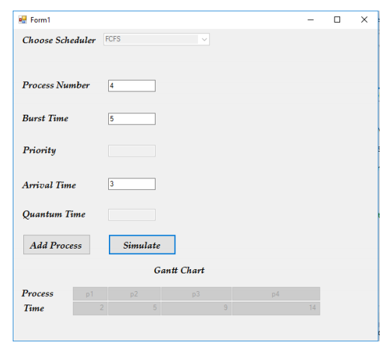
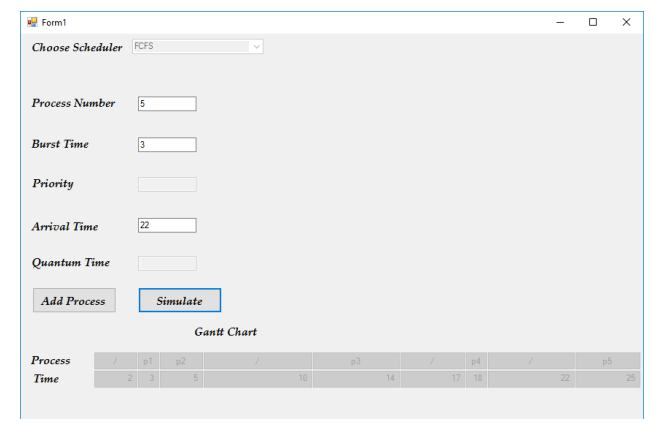
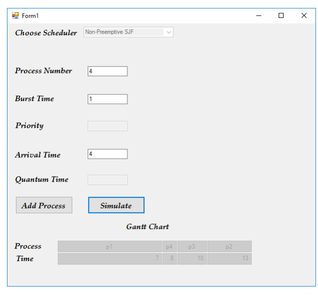
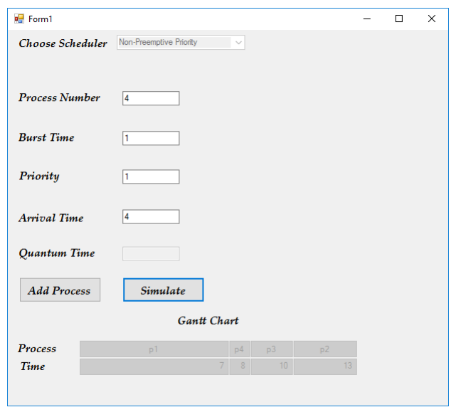
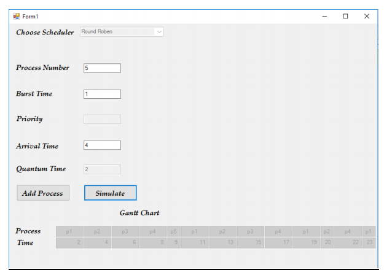

## The software GUI

### How to run

1-  Choose the scheduler type from the menu. 

2-  Enter process number, ie (1 is equivalent to “P1”) , (2 is equivalent to “P2”) and so on 

3-  Enter the burst time for the process.

4-  Enter priority if needed.

5-  Enter arrival time of the process.

6-  Enter Quantum time if the scheduler is “Round-Roben”.

7-  Click on (Add Process) button to add this process.

8-  For each process follow the steps shown above. Note: You are allowed to add any number of processes.

9-  After adding the processes, click on (Simulate) button to display the (Gantt Chart)

**Note**
Simulation is done once, (if you add 4 processes then clicked on Simulate , you 
aren’t allowed to simulate one more time till you close the program and open it again

**Note**
Means that the processor is doing nothing (idle).

## FCFS Scheduler

### Example 1
Process | Burst time | Arrival time
--| -- | ---
P1 |  2 | 0
P2 | 3  |1
P3 | 4  |2
P4 | 5  |3

### Example 2

Process | Burst time | Arrival time
--| -- | ---
P1 | 1 | 2
P2 | 2 | 3
P3 | 4 | 10
P4 | 1 | 17
P5 | 3 | 22

## Non pre-emptive

Process | Burst time | Arrival time
--| -- | ---
P1 | 7 | 0
P2 | 3 | 1
P3 | 2 | 3
P4 | 1 | 4

## Non pre-emptive priority

Process | Burst time | Arrival time | Priority
--| -- | --- | ---
P1 | 7 |  0 | 2
P2 | 3 |  1 | 4
P3 | 2 |  3 | 3
P4 | 1 |  4 | 1

## Round robbin

Process | Burst time | Arrival time
--| -- | ---
P1 | 7 | 0
P2 | 5 | 1
P3 | 4 | 2
P4 | 6 | 3
P5 | 1 | 4

